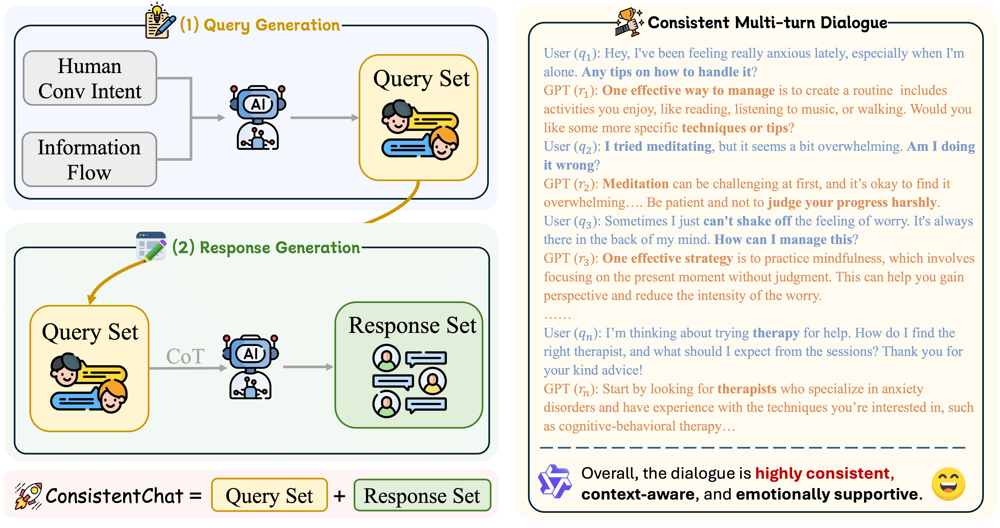

# ConsistentChat: Building Skeleton-Guided Consistent Multi-Turn Dialogues for Large Language Models from Scratch

<div align="center">
  
  

<br>
<a href="https://arxiv.org/abs/2506.03558">
  <strong>📃 Paper</strong>
</a>
• <a href="https://huggingface.co/jiawei-ucas/Qwen-2.5-7B-ConsistentChat">
  <strong>🤖 Model</strong>
</a>
• <a href="https://huggingface.co/datasets/jiawei-ucas/ConsistentChat">
  <strong>🤗 Dataset</strong>
</a></div>


## 📅 News

- [2025/09]: 🔥 We have released code, dataset and model checkpoint publicly to encourage future research!
- [2025/08]: 🎉 Paper accepted to **EMNLP 2025**! 


--------------------------------------------------------------------------------

<span id="content">
</span>

## 📚 Content

- [1\. Introduction](#introduction)
- [2\. Statistics](#statistics)
- [3\. Quick Start](#quick-start)
- [4\. Data Structure & Usage](#data-structure--usage)
- [5\. Testing & Configuration](#testing--configuration)
- [6\. Recommended Tools](#recommended-tools)
- [Citation](#citation)


<span id="introduction">
</span>

## 📘 1\. Introduction [[Back to Top]](#content)

Current instruction data synthesis methods primarily focus on single-turn instructions and often neglect cross-turn coherence, resulting in context drift and reduced task completion rates in extended conversations. To address this limitation, we propose Skeleton-Guided Multi-Turn Dialogue Generation, a framework that constrains multi-turn instruction synthesis by explicitly modeling human conversational intent. It operates in two stages: (1) Intent Modeling, which captures the global structure of human dialogues by assigning each conversation to one of nine well-defined intent trajectories, ensuring a coherent and goal-oriented information flow; and (2) Skeleton Generation, which constructs a structurally grounded sequence of user queries aligned with the modeled intent, thereby serving as a scaffold that constrains and guides the downstream instruction synthesis process. Based on this process, we construct ConsistentChat, a multi-turn instruction dataset with approximately 15,000 multi-turn conversations and 224,392 utterances. Experiments on the Light, TopDial, and MT-Eval benchmarks show that models fine-tuned on ConsistentChat achieve a 20–30% improvement in chat consistency and up to a 15% increase in task success rate, significantly outperforming models trained on existing single-turn and multi-turn instruction datasets.

<div align="center">
    <br><figcaption style="text-align:left;">✏️ Figure A. Overview of our instruction synthesis framework. We design a dialogue skeleton by combining nine types of human conversational intents with corresponding curated information flows. ConsistentChat is constructed in two stages: First, we generate a set of multi-turn dialogue queries from Qwen-2.5-72B-Instruct based on the skeleton template; Then, we prompt LLMs to generate the corresponding response set with CoT method. On the right side, we present a synthetic dialogue case, which received a high assessment from Qwen-2.5-72B-Instruct. More descriptions can be found in Section 3 of the paper.</figcaption></div>


<span id="statistics">
</span>

## 📊 2\. Statistics [[Back to Top]](#content)

**ConsistentChat**, generated by Qwen-2.5-72B-Instruct, contains about 15,000 multi-turn conversations and 224,392 utterances; the table below provides more detailed statistics.

| Statistics | Problem Solving Interaction | Educational Interaction | Health Consultation Interaction | Exploratory Interaction | Entertainment Interaction | Simulation Interaction | Emotional Support Interaction | Information Retrieval Interaction | Transaction Interaction |
|---|---|---|---|---|---|---|---|---|---|
| Avg. # Utterances per Dialogue | 15.39 | 15.62 | 15.60 | 15.45 | 15.65 | 15.59 | 15.57 | 15.40 | 15.38 |
| Avg. # Words in Query  | 19.64 | 18.73 | 19.67 | 19.94 | 20.79 | 19.22 | 20.82 | 18.99 | 20.01 |
| Max. # Words in Query  | 37 | 38 | 38 | 46 | 42 | 43 | 46 | 37 | 42 |
| Avg. # Words in Response  | 59.09 | 61.91 | 60.34 | 60.44 | 56.03 | 56.63 | 62.85 | 55.58 | 56.06 |
| Max. # Words in Response  | 135 | 119 | 124 | 128 | 125 | 118 | 121 | 133 | 119 |
| Avg. # Words per Turn | 39.36 | 40.32 | 40.00 | 40.19 | 38.41 | 37.93 | 41.83 | 37.28 | 38.03 |
| Max. # Words per Turn | 135 | 119 | 124 | 128 | 125 | 118 | 121 | 133 | 119 |
| Total # Dialogues | 1631 | 1632 | 1633 | 1615 | 1585 | 1604 | 1573 | 1637 | 1551 |
| Total # Utterances | 25104 | 25494 | 25474 | 24952 | 24808 | 25002 | 24486 | 25216 | 23856 |


<span id="quick-start">
</span>

## 🚀 3. Quick Start [[Back to Top]](#content)

### 1. Installation

```bash
git clone https://github.com/chenjiawei30/ConsistentChat.git
cd ConsistentChat

# Install dependencies
pip install -r requirements.txt
```

### 2. Configuration

Edit `config.py` to set your API settings:

```python
API_CONFIG = {
    "base_url": "http://your-api-endpoint/v1",
    "api_key": "your-api-key",
    "model": "your-model-name"
}
```

### 3. Test the System

```bash
python test.py
```

### 4. Generate Dialogues

```bash
# Test single dialogue generation
python main.py test

# Batch generation
python main.py
```

<span id="data-structure--usage">
</span>

## 📊 4. Data Structure & Usage [[Back to Top]](#content)

### Data Structure

The dummy data structure is clean and easy to understand:

```json
{
    "categories": {
        "Problem-solving Interaction": {
            "scenarios": [
                "Technical Support",
                "Home Repair",
                "Travel Planning"
            ],
            "flow_type": "problem_diagnosis_to_solution"
        }
    },
    "flow_definitions": {
        "problem_diagnosis_to_solution": {
            "steps": [
                "Identifying the problem",
                "Analyzing the cause",
                "Proposing a solution",
                "Feedback and improvement"
            ]
        }
    }
}
```

### Basic Usage

```python
from dialogue_generator import DialogueGenerator

# Initialize generator
generator = DialogueGenerator(
    base_url="http://your-api/v1",
    api_key="your-key",
    model="your-model"
)

# Load data
data = generator.load_data("data/dummy_data.json")

# Generate single dialogue
dialogue = generator.generate_dialogue(
    category="Problem-solving Interaction",
    scenario="Technical Support",
    flow_type="problem_diagnosis_to_solution",
    query_prompt_template=query_template,
    response_prompt_template=response_template,
    flow_definitions=data["flow_definitions"]
)
```

### Batch Generation

```python
# Generate all dialogues
all_dialogues = generator.batch_generate(
    data=data,
    query_prompt_template=query_template,
    response_prompt_template=response_template,
    output_file="generated_dialogues.json"
)
```

<span id="testing--configuration">
</span>

## 🧪 5. Testing & Configuration [[Back to Top]](#content)

### Testing

Run the comprehensive test suite:

```bash
python test.py
```

Expected output:
```
Starting dialogue generation: Problem-solving Interaction - Technical Support
✓ Using flow type: problem_diagnosis_to_solution
Generating query questions: Problem-solving Interaction - Technical Support
✓ Query generation completed: x questions
Generating responses: Problem-solving Interaction - Technical Support
✓ Response generation completed: x responses
✓ Dialogue generation completed: x turns
```

### Configuration Options

#### API Configuration
```python
API_CONFIG = {
    "base_url": "http://localhost:7813/v1",
    "api_key": "your-api-key",
    "model": "Qwen-2.5-72B-Instruct"
}
```

#### Generation Configuration
```python
GENERATION_CONFIG = {
    "max_tokens_query": 800,
    "max_tokens_response": 1200,
    "temperature_query": 0.8,
    "temperature_response": 0.7,
    "max_retries": 3,
    "retry_delay": 1
}
```

### Adding New Categories

To add new dialogue categories, edit `data/dummy_data.json`:

```json
{
    "categories": {
        "Your New Category": {
            "scenarios": ["Scenario 1", "Scenario 2"],
            "flow_type": "other flow types in paper"
        }
    }
}
```

<span id="recommended-tools">
</span>

## 🛠️ 6. Recommended Tools [[Back to Top]](#content)

For training and inference with ConsistentChat-Trained models, we recommend using the following tools:

### LLaMA-Factory for SFT (Supervised Fine-Tuning)

[LLaMA-Factory](https://github.com/hiyouga/LLaMA-Factory) is a unified framework for fine-tuning large language models with efficient training strategies and comprehensive features.

**Key Features:**
- Support for multiple model architectures (LLaMA, Qwen, ChatGLM, etc.)
- Efficient training with full fine-tuning, LoRA, and QLoRA
- Easy configuration with YAML files
- Built-in evaluation and inference capabilities

**Quick Start:**
```bash
# Install LLaMA-Factory
git clone https://github.com/hiyouga/LLaMA-Factory.git
cd LLaMA-Factory
pip install -e .

# Full fine-tuning with ConsistentChat dataset
llamafactory-cli train examples/train_sft/llama3_sft.yaml
```

### vLLM for Model Inference

[vLLM](https://github.com/vllm-project/vllm) is a fast and easy-to-use library for LLM inference and serving, featuring high throughput and low latency.

**Key Features:**
- High-throughput inference with PagedAttention
- Support for various model formats and frameworks
- Easy deployment with RESTful API
- Optimized memory usage and GPU utilization

**Quick Start:**
```bash
# Install vLLM
pip install vllm

# Start inference server
python -m vllm.entrypoints.openai.api_server \
    --model your-model-path \
    --port 8000

# Use with OpenAI-compatible API
curl http://localhost:8000/v1/chat/completions \
    -H "Content-Type: application/json" \
    -d '{
        "model": "your-model-path",
        "messages": [{"role": "user", "content": "Compose an engaging travel blog post about a recent trip to Hawaii, highlighting cultural experiences and must-see attractions."}]
    }'
```

### Integration Example

Here's how to combine both tools for a complete pipeline:

1. **Fine-tuning with LLaMA-Factory:**
```yaml
# train_config.yaml
model_name: qwen2.5-7b
dataset: consistentchat
template: qwen
finetuning_type: full
output_dir: ./saves/qwen2.5-7b-consistentchat
```

2. **Deploy with vLLM:**
```bash
# Serve the full fine-tuned model with vLLM
python -m vllm.entrypoints.openai.api_server \
    --model ./saves/qwen2.5-7b-consistentchat \
    --port 8080
```

<span id="citation">
</span>

## 📄 Citation

If you find our paper and resources useful, please consider citing our paper:

```bibtex
@misc{chen2025consistentchat,
      title={ConsistentChat: Building Skeleton-Guided Consistent Dialogues for Large Language Models from Scratch}, 
      author={Jiawei Chen and Xinyan Guan and Qianhao Yuan and Guozhao Mo and Weixiang Zhou and Yaojie Lu and Hongyu Lin and Ben He and Le Sun and Xianpei Han},
      year={2025},
      eprint={2506.03558},
      archivePrefix={arXiv},
      primaryClass={cs.CL},
      url={https://arxiv.org/abs/2506.03558}, 
}
```

## 🙏 Acknowledgement

This repo benefits from [Light](https://parl.ai/projects/light), [TopDial](https://github.com/iwangjian/TopDial), [Midi-Tuning](https://github.com/iwangjian/Midi-Tuning) and [MT-Eval](https://github.com/KwanWaiChung/MT-Eval). Thanks for their wonderful works!